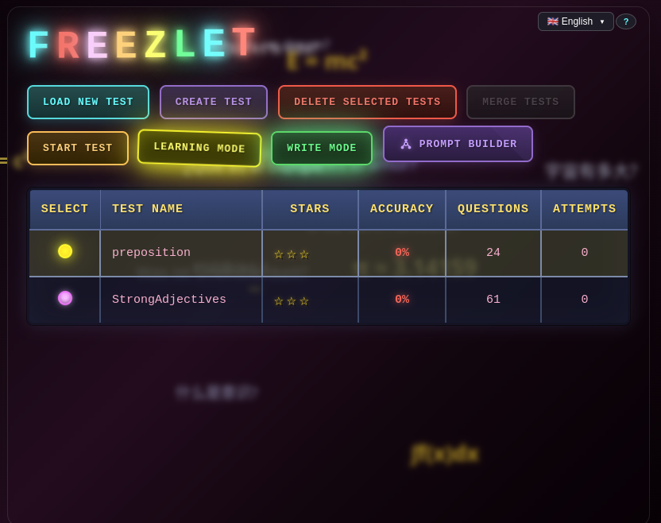

<p align="center">
  
</p>

<p align="center">
  
  
  
  
  
  
  
  
</p>

<p align="center">
  <b>A gamified desktop application for learning and memorizing anything - languages, math, science, history and more - with Pacman-style progress tracking</b>
</p>

---

## Table of Contents

- [Demo](#demo)
- [Why FREEZLET?](#why-freezlet)
- [Screenshots](#screenshots)
- [Features](#features)
- [Background System](#background-system)
- [Installation](#installation)
- [Usage](#usage)
- [Architecture](#architecture)
- [Tech Stack](#tech-stack)
- [Test File Format](#test-file-format)
- [Localization](#localization)
- [Contributing](#contributing)
- [License](#license)

---

## Demo

<p align="center">
  
</p>

---

## Why FREEZLET?

**Learning shouldn't feel like a chore.** FREEZLET transforms memorization into an immersive experience:

| Traditional Apps | FREEZLET |
|------------------|----------|
| Static white screens | Dynamic AI-generated backgrounds |
| Silent repetition | Visual feedback & animations |
| Boring progress bars | Gamified progress indicators |
| One learning mode | Multiple modes: Learn, Test, Write |

Every element is designed to keep you engaged — changing backgrounds tell a visual story, animated feedback rewards your progress, and gamification makes each session feel like play rather than study.

---

## Screenshots

### Main Menu

*Category tree navigation and test management*

### Test Table

*Test list with progress tracking - stars, accuracy, questions count and attempts*

### Learning Mode

*Interactive quiz with background settings menu (Story/Random/Load/My Backgrounds)*


*Dynamic AI-generated backgrounds and Pacman ghost progress indicator*

### Write Mode

*Type your answers with hints available - practice spelling and recall*

---

## Features

- **Learning Mode** - Gamified learning with Pacman-style progress visualization
- **Test Mode** - Traditional quiz format for self-assessment
- **Write Mode** - Practice spelling by typing answers
- **8 Languages** - Interface available in EN, DE, ES, FR, PT, UK, ZH, PL
- **Progress Tracking** - SQLite database stores your learning history
- **Dynamic Backgrounds** - Multiple background modes for immersive learning
- **Category Organization** - Hierarchical folder structure for tests
- **Merge Tests** - Combine multiple tests into one
- **Prompt Builder** - AI-assisted test creation helper

---

## Background System

FREEZLET features a unique background system that makes learning more engaging:

| Mode | Description |
|------|-------------|
| **Story Mode** | Sequential backgrounds that tell a visual story as you progress |
| **Random Mode** | Random AI-generated backgrounds for variety |
| **My Backgrounds** | Upload and use your own images |
| **Load Background** | Load a single custom image |

### Features:
- **AI-generated artwork** - Beautiful, immersive backgrounds
- **Progress visualization** - Backgrounds change as you advance
- **Personal gallery** - Save your favorite backgrounds
- **Full customization** - Use any image you like

---

## Installation

### Prerequisites
- Node.js 18+
- npm or yarn

### Steps

```bash
# Clone the repository
git clone https://github.com/Gary938/FREEZLET.git

# Navigate to project directory
cd FREEZLET

# Install dependencies
npm install

# Rebuild native modules for Electron
npm run rebuild

# Build the application
npm run build

# Start the application
npm start
```

### Quick Start (Linux/macOS)
```bash
./start.sh
```
This script creates a backup and launches the application.

---

## Usage

### Creating Tests

1. Click **"+ New Category"** to create a category
2. Select the category and click **"CREATE TEST"** or **"LOAD NEW TEST"**
3. Test file format (`.txt`):
```
question | answer
apple | яблоко
book | книга
```

### Learning Mode

1. Select a test from the table
2. Click **"LEARNING MODE"**
3. Answer questions by clicking the correct option
4. Watch Pacman eat ghosts as you progress!

### Test Mode

1. Select a test
2. Click **"START TEST"**
3. Complete all questions
4. View your results and statistics

---

## Architecture

```
FREEZLET/
├── Main/                    # Main Process (Electron)
│   ├── API/                # API layer
│   ├── Controllers/        # IPC handlers
│   ├── BusinessLayer/      # Core business logic
│   │   ├── DB/            # SQLite operations
│   │   ├── FileSystem/    # File operations
│   │   └── LearnMode/     # Learning mode logic
│   └── Logger/            # Logging system
│
├── UI/                     # Renderer Process
│   ├── LearnMode/         # 7-layer learning mode UI
│   │   ├── Core/          # State management
│   │   ├── Components/    # UI components + Pacman
│   │   ├── Controllers/   # Business logic
│   │   └── Facade/        # Main facade
│   ├── Controllers/       # UI controllers
│   └── Bridge/            # IPC communication
│
├── Preload/               # Secure IPC bridge
├── Tests/                 # Test files storage
├── Progress/              # SQLite database
└── Locales/               # Translation files (8 languages)
```

---

## Tech Stack

| Technology | Purpose |
|------------|---------|
| [Electron 28](https://www.electronjs.org/) | Desktop application framework |
| [better-sqlite3](https://github.com/WiseLibs/better-sqlite3) | SQLite database |
| [i18next](https://www.i18next.com/) | Internationalization |
| [Webpack 5](https://webpack.js.org/) | Module bundling |
| [Babel](https://babeljs.io/) | JavaScript transpilation |

---

## Scripts

| Command | Description |
|---------|-------------|
| `npm start` | Start the application |
| `npm run build` | Build webpack bundles |
| `npm run rebuild` | Rebuild native modules |
| `npm run check-api` | Validate API consistency |
| `./start.sh` | Backup + start (Linux/macOS) |
| `./rebuild_webpack.sh` | Clean rebuild webpack |

---

## Test File Format

Tests are simple text files with `question | answer` format:

```
# Example: Vocabulary
hello | hola
apple | яблоко
```

```
# Example: Math
2 + 2 | 4
√144 | 12
15% of 200 | 30
```

```
# Example: Science
H2O | Water
Speed of light | 299,792,458 m/s
Largest planet | Jupiter
```

```
# Example: History
Year WW2 ended | 1945
First US President | George Washington
```

### Advanced Format
```
# With phonetic transcription (for languages)
Appeal [əˈpiːl] | to
Depend [dɪˈpend] | on
```

---

## Localization

FREEZLET supports 8 languages:

| Code | Language |
|------|----------|
| `en` | English |
| `de` | German |
| `es` | Spanish |
| `fr` | French |
| `pt` | Portuguese |
| `uk` | Ukrainian |
| `zh` | Chinese |
| `pl` | Polish |

Switch language using the dropdown in the top-right corner.

---

## Project Stats

- **38,000+** lines of JavaScript
- **417** source files
- **7-layer** UI architecture
- **6-layer** backend architecture
- **18+** Pacman visual effects

---

## License

This project is licensed under the MIT License - see the [LICENSE](LICENSE) file for details.

Copyright © 2025 Gary938

---

## Contributing

Contributions are welcome! Please feel free to submit a Pull Request.

1. Fork the repository
2. Create your feature branch (`git checkout -b feature/AmazingFeature`)
3. Commit your changes (`git commit -m 'Add some AmazingFeature'`)
4. Push to the branch (`git push origin feature/AmazingFeature`)
5. Open a Pull Request

---

<p align="center">
  Made with ❤️ for learners
</p>
